Apk Size Reduction - take appcompat / lottie as example
-------------------------------------------------------

Download size in KB

<table>
<col width="20%" />
<col width="20%" />
<col width="20%" />
<col width="20%" />
<col width="20%" />
<tbody>
<tr class="odd">
<td align="left">

</td>
<td align="left">
ApkSize
</td>
<td align="left">
dex
</td>
<td align="left">
resources.arsc
</td>
<td align="left">
res
</td>
</tr>
<tr class="even">
<td align="left">
empty app
</td>
<td align="left">
64.3
</td>
<td align="left">
0.35
</td>
<td align="left">
0.53
</td>
<td align="left">
62.3
</td>
</tr>
<tr class="odd">
<td align="left">
import AppCompat
</td>
<td align="left">
435.7
</td>
<td align="left">
167.8
</td>
<td align="left">
49.7
</td>
<td align="left">
222.8
</td>
</tr>
<tr class="even">
<td align="left">
dummy_layout
</td>
<td align="left">
228.3
</td>
<td align="left">
0.65
</td>
<td align="left">
48.9
</td>
<td align="left">
198.6
</td>
</tr>
<tr class="odd">
<td align="left">
aapt - remove res
</td>
<td align="left">
113.4
</td>
<td align="left">
0.65
</td>
<td align="left">
48.9
</td>
<td align="left">
63
</td>
</tr>
<tr class="even">
<td align="left">
import lottie
</td>
<td align="left">
200.8
</td>
<td align="left">
84.1
</td>
<td align="left">
49.1
</td>
<td align="left">
63.2
</td>
</tr>
<tr class="odd">
<td align="left">
resguard
</td>
<td align="left">
196.5
</td>
<td align="left">
84.1
</td>
<td align="left">
40.9
</td>
<td align="left">
63.2
</td>
</tr>
<tr class="even">
<td align="left">
resguard[mod]
</td>
<td align="left">
189.7
</td>
<td align="left">
84.1
</td>
<td align="left">
37.3
</td>
<td align="left">
63.2
</td>
</tr>
<tr class="odd">
<td align="left">
remove string
</td>
<td align="left">
173.2
</td>
<td align="left">
84.1
</td>
<td align="left">
18.4
</td>
<td align="left">
63.2
</td>
</tr>
<tr class="even">
<td align="left">
Remove AppCompat Styles
</td>
<td align="left">
149.2
</td>
<td align="left">
73.5
</td>
<td align="left">
5.7
</td>
<td align="left">
62.4
</td>
</tr>
<tr class="even">
<td align="left">
Remove XML entity
</td>
<td align="left">
144.9
</td>
<td align="left">
72.5
</td>
<td align="left">
2.2
</td>
<td align="left">
62.4
</td>
</tr>
</tbody>
</table>

Empty App
---------

proguardFiles

1.  proguard-android-optimize.txt
2.  appt-rules.txt

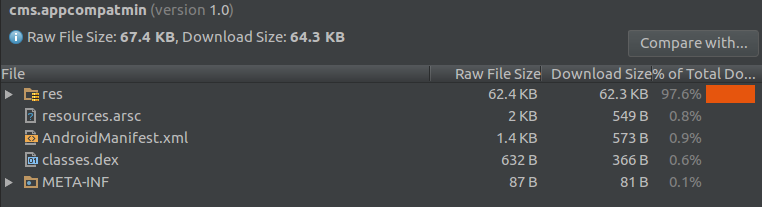

aapt\_rules.txt

mapping.txt

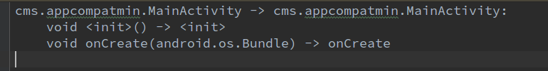

### import AppComapt-v7

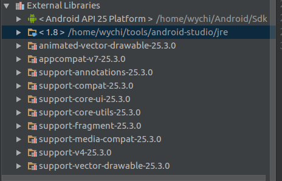

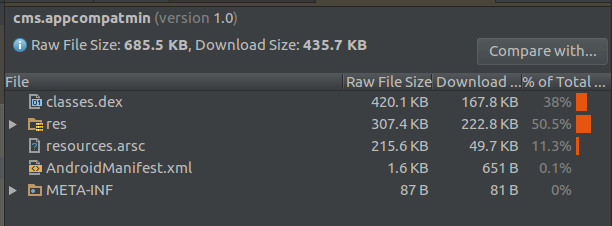

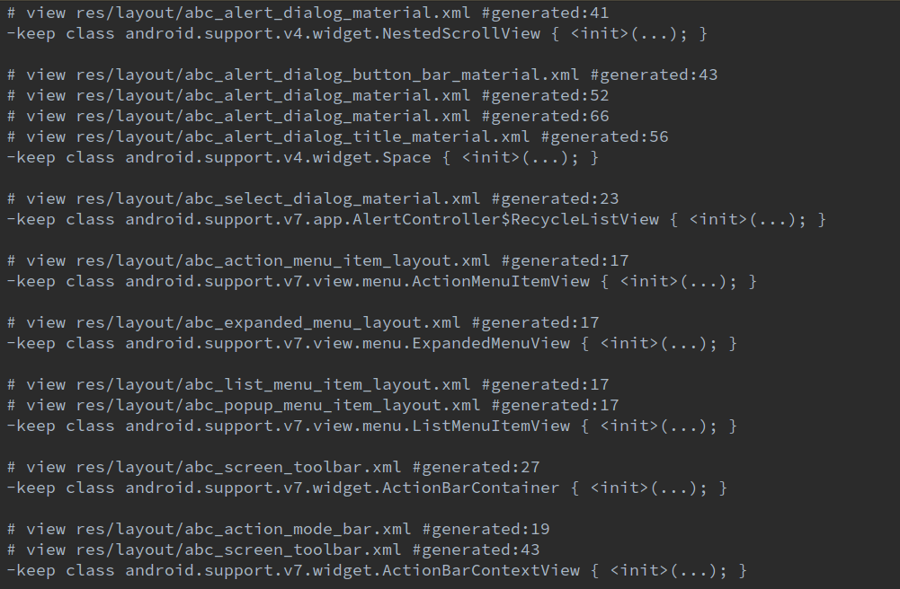

mapping.txt

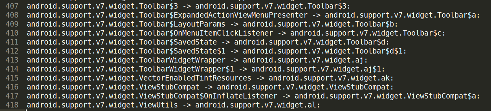

### dummy\_layout

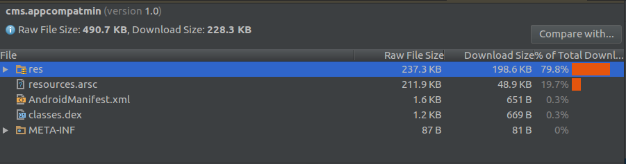

aapt\_rules.txt

mapping.txt

### aapt - remove res

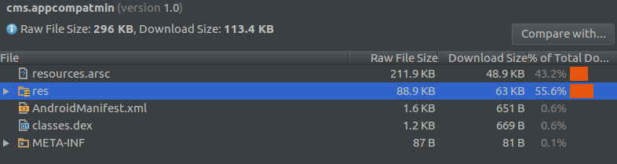

### import lottie

### 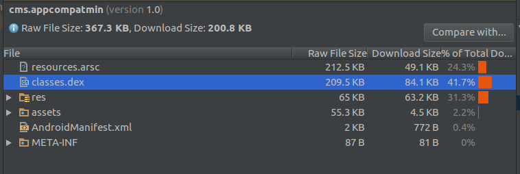

### 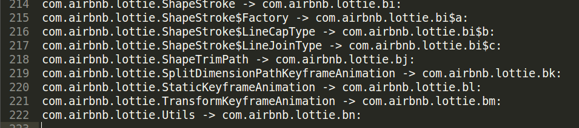

### resguard

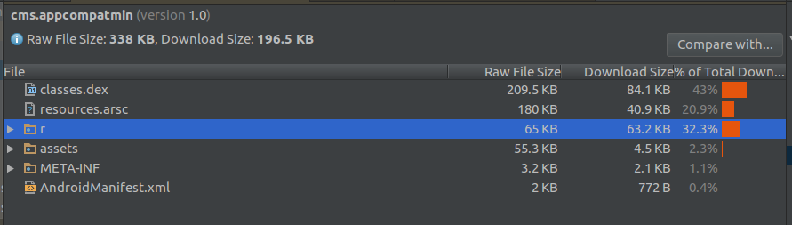

### resguard [mod] - clean entity

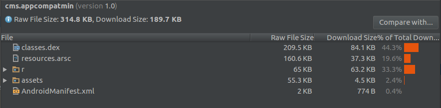

[http://www.jianshu.com/p/60ce4bf20f72](https://www.google.com/url?q=http://www.jianshu.com/p/60ce4bf20f72&sa=D&ust=1490606924786000&usg=AFQjCNHEeuDZ4EaObUcehRFZd3NTzJRcyQ)

[http://blog.csdn.net/luoshengyang/article/details/8744683](https://www.google.com/url?q=http://blog.csdn.net/luoshengyang/article/details/8744683&sa=D&ust=1490606924787000&usg=AFQjCNEzm0BfgXgBZfTQLZZeAFGixTORPA)

com.tencent.mm.androlib.ApkDecoder\#decode

### Remove Strings

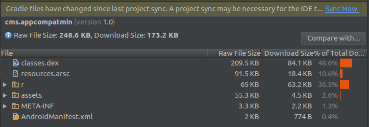

### Remove AppCompat - Style/Layout/Drawable reffed by values.xml

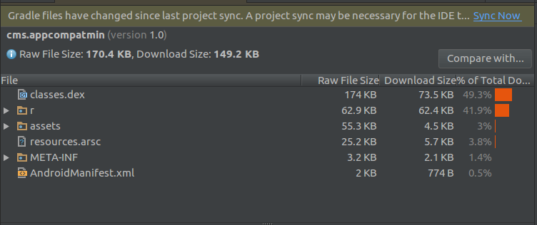

Reference
---------

gradle tasks

<table>
<col width="50%" />
<col width="50%" />
<tbody>
<tr class="odd">
<td align="left">
Gradle Tasks
</td>
<td align="left">
Comments
</td>
</tr>
<tr class="even">
<td align="left">
:app:generateReleaseResValues

:app:mergeReleaseResources

:app:processReleaseManifest
</td>
<td align="left">

</td>
</tr>
<tr class="odd">
<td align="left">

</td>
<td align="left">
doFirst

replace files (layout/ …)

modify values.xml to remove styles
</td>
</tr>
<tr class="even">
<td align="left">
:app:processReleaseResources

</td>
<td align="left">
intermediates: (most of intermediates files are created at this point)

output:

aapt_rules.txt

resources-release.ap_
</td>
</tr>
<tr class="odd">
<td align="left">

</td>
<td align="left">
doLast

remove PNGs from resources-release.ap_
</td>
</tr>
<tr class="even">
<td align="left">
:app:transformClassesWithDexForRelease
</td>
<td align="left">

</td>
</tr>
<tr class="odd">
<td align="left">
:app:transformClassesWithShrinkResForRelease
</td>
<td align="left">

</td>
</tr>
<tr class="even">
<td align="left">
:app:packageRelease
</td>
<td align="left">

</td>
</tr>
<tr class="odd">
<td align="left">
:app:assembleRelease
</td>
<td align="left">
output: app-release.apk
</td>
</tr>
<tr class="even">
<td align="left">
:app:resguardRelease
</td>
<td align="left">
output: AndResGuard_app-release/app-release_signed_aligned.apk

rename res/*

remove entity R.drawable.XXX
</td>
</tr>
</tbody>
</table>

Findings

styles -- ref --\> layout -- affect --\>  proguard (aapt\_rules.txt)

                   --\> drawable -- affect --\>  shrink resource

AppCompat

<table>
<col width="100%" />
<tbody>
<tr class="odd">
<td align="left">
values.xml

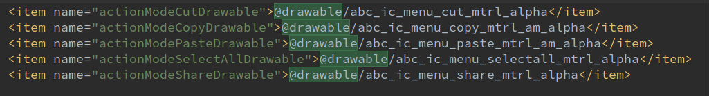

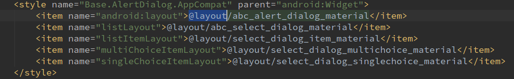
</td>
</tr>
</tbody>
</table>

NOT WORKING (in this case)

<table>
<col width="100%" />
<tbody>
<tr class="odd">
<td align="left">
<a href="https://www.google.com/url?q=https://developer.android.com/studio/build/shrink-code.html%23keep-resources&amp;sa=D&amp;ust=1490606924821000&amp;usg=AFQjCNHAX_bOKREfOoj9VlGbinFsTIiIew">https://developer.android.com/studio/build/shrink-code.html#keep-resources</a>

res/raw/keep.xml

&lt;?xml version=&quot;1.0&quot; encoding=&quot;utf-8&quot;?&gt;

&lt;resources xmlns:tools=&quot;http://schemas.android.com/tools&quot;

    tools:keep=&quot;@layout/l_used*_c,@layout/l_used_a,@layout/l_used_b*&quot;

    tools:discard=&quot;@layout/unused2&quot; /&gt;

</td>
</tr>
</tbody>
</table>

Remove files directly will cause runtime exceptions

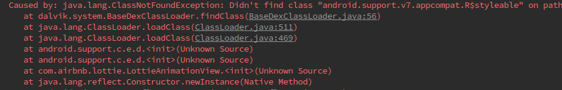

aapt commands

<table>
<col width="100%" />
<tbody>
<tr class="odd">
<td align="left">
Starting process 'command '/home/wychi/Android/Sdk/build-tools/25.0.2/aapt''. Working directory: /home/wychi/repository/AppCompatMin/app Command: /home/wychi/Android/Sdk/build-tools/25.0.2/aapt package -f --no-crunch -I /home/wychi/Android/Sdk/platforms/android-25/android.jar -M /home/wychi/repository/AppCompatMin/app/build/intermediates/manifests/full/release/AndroidManifest.xml -S /home/wychi/repository/AppCompatMin/app/build/intermediates/res/merged/release -m -J /home/wychi/repository/AppCompatMin/app/build/generated/source/r/release -F /home/wychi/repository/AppCompatMin/app/build/intermediates/res/resources-release.ap_ -G /home/wychi/repository/AppCompatMin/app/build/intermediates/proguard-rules/release/aapt_rules.txt --custom-package cms.appcompatmin -0 apk --output-text-symbols /home/wychi/repository/AppCompatMin/app/build/intermediates/symbols/release --no-version-vectors

Successfully started process 'command '/home/wychi/Android/Sdk/build-tools/25.0.2/aapt''

</td>
</tr>
</tbody>
</table>

ref

Android gradle plugin

[http://google.github.io/android-gradle-dsl/javadoc/](https://www.google.com/url?q=http://google.github.io/android-gradle-dsl/javadoc/&sa=D&ust=1490606924832000&usg=AFQjCNF864zPEYsn835mzx8bnQOfHaZcEg)

[https://github.com/google/android-gradle-dsl](https://www.google.com/url?q=https://github.com/google/android-gradle-dsl&sa=D&ust=1490606924832000&usg=AFQjCNE5S8N52mGADK_qPQvsqwOIrQ2ZMA)

[https://android.googlesource.com/platform/tools/build/+/master/gradle/src/main/groovy/com/android/build/gradle/tasks/](https://www.google.com/url?q=https://android.googlesource.com/platform/tools/build/%2B/master/gradle/src/main/groovy/com/android/build/gradle/tasks/&sa=D&ust=1490606924833000&usg=AFQjCNGvPb7gNtHP6iTmtkbEMp5e1YrJcA)

git clone [https://android.googlesource.com/platform/tools/build](https://www.google.com/url?q=https://android.googlesource.com/platform/tools/build&sa=D&ust=1490606924834000&usg=AFQjCNFvbh-BfCMvYrJBk9KVYzQoAjeXqA)

[https://android.googlesource.com/platform/dalvik/+/a9ac3a9d1f8de71bcdc39d1f4827c04a952a0c29/dx/src/com/android/dx/command/dexer/Main.java?autodive=0](https://www.google.com/url?q=https://android.googlesource.com/platform/dalvik/%2B/a9ac3a9d1f8de71bcdc39d1f4827c04a952a0c29/dx/src/com/android/dx/command/dexer/Main.java?autodive%3D0&sa=D&ust=1490606924835000&usg=AFQjCNEyw3HYcE5qSzTIQKPXorbeQ1w6og)

Proguard

[https://www.guardsquare.com/en/proguard/manual/usage\#keepoptionmodifiers](https://www.google.com/url?q=https://www.guardsquare.com/en/proguard/manual/usage%23keepoptionmodifiers&sa=D&ust=1490606924836000&usg=AFQjCNGqsk269JATWtmTL19jOLKOdf3d7A)

<table>
<col width="100%" />
<tbody>
<tr class="odd">
<td align="left">
If you specify a class, without class members, ProGuard only preserves the class and its parameterless constructor as entry points. It may still remove, optimize, or obfuscate its other class members.

If you specify a method, ProGuard only preserves the method as an entry point. Its code may still be optimized and adapted.

</td>
</tr>
<tr class="even">
<td align="left">
/home/wychi/repository/cmsecurity/build/intermediates/proguard-files/proguard-android-optimize.txt-2.3.0

# Keep setters in Views so that animations can still work.

-keepclassmembers public class !android.support.v7.** extends android.view.View {

   void set*(***);

   *** get*();

}
</td>
</tr>
</tbody>
</table>

