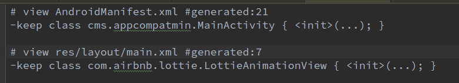

Apk Size Reduction - take appcompat / lottie as example {#h.34ryil71oeas .c21}
-------------------------------------------------------

Download size in KB

+----------------+----------------+----------------+----------------+----------------+
|                | ApkSize        | dex            | resources.arsc | res            |
+----------------+----------------+----------------+----------------+----------------+
| empty app      | 64.3           | 0.35           | 0.53           | 62.3           |
+----------------+----------------+----------------+----------------+----------------+
| import         | 435.7          | 167.8          | 49.7           | 222.8          |
| AppCompat      |                |                |                |                |
+----------------+----------------+----------------+----------------+----------------+
| dummy\_layout  | 228.3          | 0.65           | 48.9           | 198.6          |
+----------------+----------------+----------------+----------------+----------------+
| aapt - remove  | 113.4          | 0.65           | 48.9           | 63             |
| res            |                |                |                |                |
+----------------+----------------+----------------+----------------+----------------+
| import lottie  | 200.8          | 84.1           | 49.1           | 63.2           |
+----------------+----------------+----------------+----------------+----------------+
| resguard       | 196.5          | 84.1           | 40.9           | 63.2           |
+----------------+----------------+----------------+----------------+----------------+
| resguard[mod]  | 189.7          | 84.1           | 37.3           | 63.2           |
+----------------+----------------+----------------+----------------+----------------+
| remove string  | 173.2          | 84.1           | 18.4           | 63.2           |
+----------------+----------------+----------------+----------------+----------------+
| Remove         | 149.2          | 73.5           | 5.7            | 62.4           |
| AppCompat      |                |                |                |                |
| Styles         |                |                |                |                |
+----------------+----------------+----------------+----------------+----------------+

Empty App {#h.wl432oyyk99e .c21}
---------

proguardFiles

1.  proguard-android-optimize.txt
2.  appt-rules.txt

aapt\_rules.txt

mapping.txt

### import AppComapt-v7 {#h.2ttrfapxxt1p .c5}

mapping.txt

### dummy\_layout {#h.5boxlaoi4uor .c5}

aapt\_rules.txt

mapping.txt

### aapt - remove res {#h.h8r2z28d2osq .c5}

### import lottie {#h.5302kqrdtpq1 .c5}

###  {#h.w6hf9cvihqgc .c5}

###  {#h.sdxbg6nkkozc .c5}

### resguard {#h.fwx73hcapxj .c5}

### resguard [mod] - clean entity {#h.11m4qn1aroe5 .c5}

[http://www.jianshu.com/p/60ce4bf20f72](https://www.google.com/url?q=http://www.jianshu.com/p/60ce4bf20f72&sa=D&ust=1490606924786000&usg=AFQjCNHEeuDZ4EaObUcehRFZd3NTzJRcyQ)

[http://blog.csdn.net/luoshengyang/article/details/8744683](https://www.google.com/url?q=http://blog.csdn.net/luoshengyang/article/details/8744683&sa=D&ust=1490606924787000&usg=AFQjCNEzm0BfgXgBZfTQLZZeAFGixTORPA)

com.tencent.mm.androlib.ApkDecoder\#decode

### Remove Strings {#h.9uiw9urxme3z .c5}

### Remove AppCompat - Style/Layout/Drawable reffed by values.xml {#h.9epamc6bz1id .c5}

Reference {#h.rcu49md70rjd .c21}
---------

gradle tasks

+--------------------------------------+--------------------------------------+
| Gradle Tasks                         | Comments                             |
+--------------------------------------+--------------------------------------+
| :app:generateReleaseResValues        |                                      |
|                                      |                                      |
| :app:mergeReleaseResources           |                                      |
|                                      |                                      |
| :app:processReleaseManifest          |                                      |
+--------------------------------------+--------------------------------------+
|                                      | doFirst                              |
|                                      |                                      |
|                                      | replace files (layout/ …)            |
|                                      |                                      |
|                                      | modify values.xml to remove styles   |
+--------------------------------------+--------------------------------------+
| :app:processReleaseResources         | intermediates: (most of              |
|                                      | intermediates files are created at   |
|                                      | this point)                          |
|                                      |                                      |
|                                      | output:                              |
|                                      |                                      |
|                                      | aapt\_rules.txt                      |
|                                      |                                      |
|                                      | resources-release.ap\_               |
+--------------------------------------+--------------------------------------+
|                                      | doLast                               |
|                                      |                                      |
|                                      | remove PNGs from                     |
|                                      | resources-release.ap\_               |
+--------------------------------------+--------------------------------------+
| :app:transformClassesWithDexForRelea |                                      |
| se                                   |                                      |
+--------------------------------------+--------------------------------------+
| :app:transformClassesWithShrinkResFo |                                      |
| rRelease                             |                                      |
+--------------------------------------+--------------------------------------+
| :app:packageRelease                  |                                      |
+--------------------------------------+--------------------------------------+
| :app:assembleRelease                 | output: app-release.apk              |
+--------------------------------------+--------------------------------------+
| :app:resguardRelease                 | output:                              |
|                                      | AndResGuard\_app-release/app-release |
|                                      | \_signed\_aligned.apk                |
|                                      |                                      |
|                                      | rename res/\*                        |
|                                      |                                      |
|                                      | remove entity R.drawable.XXX         |
+--------------------------------------+--------------------------------------+

Findings

styles -- ref --\> layout -- affect --\>  proguard (aapt\_rules.txt)

                   --\> drawable -- affect --\>  shrink resource

AppCompat

+--------------------------------------------------------------------------+
| values.xml                                                               |
|                                                                          |
|            |
|                                                                          |
|            |
+--------------------------------------------------------------------------+

NOT WORKING (in this case)

+--------------------------------------------------------------------------+
| [https://developer.android.com/studio/build/shrink-code.html\#keep-resou |
| rces](https://www.google.com/url?q=https://developer.android.com/studio/ |
| build/shrink-code.html%23keep-resources&sa=D&ust=1490606924821000&usg=AF |
| QjCNHAX_bOKREfOoj9VlGbinFsTIiIew)                                        |
|                                                                          |
| res/raw/keep.xml                                                         |
|                                                                          |
| \<?xml version="1.0" encoding="utf-8"?\>                                 |
|                                                                          |
| \<resources xmlns:tools="http://schemas.android.com/tools"               |
|                                                                          |
|                                                                          |
| tools:keep="@layout/l\_used\*\_c,@layout/l\_used\_a,@layout/l\_used\_b\* |
| "                                                                        |
|                                                                          |
|     tools:discard="@layout/unused2" /\>                                  |
+--------------------------------------------------------------------------+

Remove files directly will cause runtime exceptions

aapt commands

+--------------------------------------------------------------------------+
| Starting process 'command                                                |
| '/home/wychi/Android/Sdk/build-tools/25.0.2/aapt''. Working directory:   |
| /home/wychi/repository/AppCompatMin/app Command:                         |
| /home/wychi/Android/Sdk/build-tools/25.0.2/aapt package -f --no-crunch   |
| -I /home/wychi/Android/Sdk/platforms/android-25/android.jar -M           |
| /home/wychi/repository/AppCompatMin/app/build/intermediates/manifests/fu |
| ll/release/AndroidManifest.xml                                           |
| -S                                                                       |
| /home/wychi/repository/AppCompatMin/app/build/intermediates/res/merged/r |
| elease                                                                   |
| -m -J                                                                    |
| /home/wychi/repository/AppCompatMin/app/build/generated/source/r/release |
| -F                                                                       |
| /home/wychi/repository/AppCompatMin/app/build/intermediates/res/resource |
| s-release.ap\_                                                           |
| -G                                                                       |
| /home/wychi/repository/AppCompatMin/app/build/intermediates/proguard-rul |
| es/release/aapt\_rules.txt                                               |
| --custom-package cms.appcompatmin -0 apk --output-text-symbols           |
| /home/wychi/repository/AppCompatMin/app/build/intermediates/symbols/rele |
| ase                                                                      |
| --no-version-vectors                                                     |
|                                                                          |
| Successfully started process 'command                                    |
| '/home/wychi/Android/Sdk/build-tools/25.0.2/aapt''                       |
+--------------------------------------------------------------------------+

ref

Android gradle plugin

[http://google.github.io/android-gradle-dsl/javadoc/](https://www.google.com/url?q=http://google.github.io/android-gradle-dsl/javadoc/&sa=D&ust=1490606924832000&usg=AFQjCNF864zPEYsn835mzx8bnQOfHaZcEg)

[https://github.com/google/android-gradle-dsl](https://www.google.com/url?q=https://github.com/google/android-gradle-dsl&sa=D&ust=1490606924832000&usg=AFQjCNE5S8N52mGADK_qPQvsqwOIrQ2ZMA)

[https://android.googlesource.com/platform/tools/build/+/master/gradle/src/main/groovy/com/android/build/gradle/tasks/](https://www.google.com/url?q=https://android.googlesource.com/platform/tools/build/%2B/master/gradle/src/main/groovy/com/android/build/gradle/tasks/&sa=D&ust=1490606924833000&usg=AFQjCNGvPb7gNtHP6iTmtkbEMp5e1YrJcA)

git clone
[https://android.googlesource.com/platform/tools/build](https://www.google.com/url?q=https://android.googlesource.com/platform/tools/build&sa=D&ust=1490606924834000&usg=AFQjCNFvbh-BfCMvYrJBk9KVYzQoAjeXqA)

[https://android.googlesource.com/platform/dalvik/+/a9ac3a9d1f8de71bcdc39d1f4827c04a952a0c29/dx/src/com/android/dx/command/dexer/Main.java?autodive=0](https://www.google.com/url?q=https://android.googlesource.com/platform/dalvik/%2B/a9ac3a9d1f8de71bcdc39d1f4827c04a952a0c29/dx/src/com/android/dx/command/dexer/Main.java?autodive%3D0&sa=D&ust=1490606924835000&usg=AFQjCNEyw3HYcE5qSzTIQKPXorbeQ1w6og)

Proguard

[https://www.guardsquare.com/en/proguard/manual/usage\#keepoptionmodifiers](https://www.google.com/url?q=https://www.guardsquare.com/en/proguard/manual/usage%23keepoptionmodifiers&sa=D&ust=1490606924836000&usg=AFQjCNGqsk269JATWtmTL19jOLKOdf3d7A)

+--------------------------------------------------------------------------+
| If you specify a class, without class members, ProGuard only preserves   |
| the class and its parameterless constructor as entry points. It may      |
| still remove, optimize, or obfuscate its other class members.            |
|                                                                          |
| If you specify a method, ProGuard only preserves the method as an entry  |
| point. Its code may still be optimized and adapted.                      |
+--------------------------------------------------------------------------+
| /home/wychi/repository/cmsecurity/build/intermediates/proguard-files/pro |
| guard-android-optimize.txt-2.3.0                                         |
|                                                                          |
| \# Keep setters in Views so that animations can still work.              |
|                                                                          |
| -keepclassmembers public class !android.support.v7.\*\* extends          |
| android.view.View {                                                      |
|                                                                          |
|    void set\*(\*\*\*);                                                   |
|                                                                          |
|    \*\*\* get\*();                                                       |
|                                                                          |
| }                                                                        |
+--------------------------------------------------------------------------+

